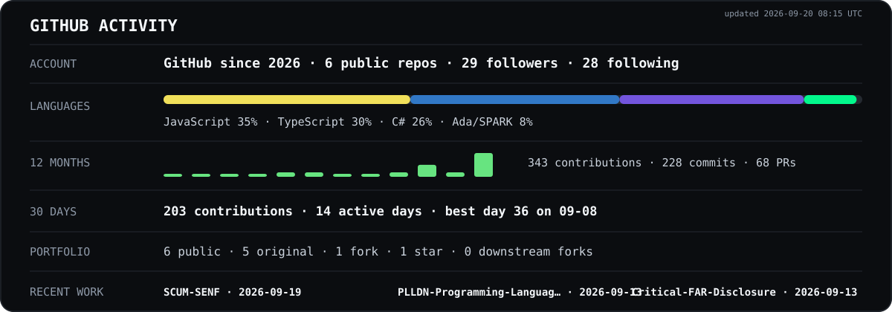

**Simple products. Uncomfortably serious engineering underneath.**

High-assurance software · security research · deterministic systems · reproducible evidence

[MyRank](https://myrank.dev/u/KeilerHirsch) · [MAYHEM Club](https://www.reddit.com/r/MAYHEMClub/) · [Ko-fi](https://ko-fi.com/keilerhirsch)

## Activity

## Current signal

The panel separates product phase from evidence. `VERIFIED` means the configured GitHub Actions workflow passed for the exact current default-branch HEAD. Stale, ambiguous, malformed, or incomplete evidence stays `UNKNOWN`. `SHIPPED` means a real public release exists — it does not inherit verification by wishful thinking.

## Selected work

### [WOLPERTINGER](https://github.com/KeilerHirsch/WOLPERTINGER)

**One core. Multiple presentation surfaces.**

An Elite Dangerous companion platform built around deterministic replay, provenance, explicit trust boundaries and a narrow high-assurance core. The complicated machinery belongs underneath; the Commander should not have to operate it.

### [PLLDN — Programming Language & Licensing Decision Navigator](https://github.com/KeilerHirsch/PLLDN-Programming-Language-Licensing-Decision-Navigator)

**Decisions you can defend.**

A deterministic language and licensing navigator where explicit project facts stay authoritative, unknown evidence stays unknown, and free text accelerates the workflow without becoming an oracle.

[Use PLLDN](https://keilerhirsch.github.io/PLLDN-Programming-Language-Licensing-Decision-Navigator/) · [Latest release](https://github.com/KeilerHirsch/PLLDN-Programming-Language-Licensing-Decision-Navigator/releases)

## How I build

- **Evidence before claims.** Tests, provenance and reproducible artifacts should support what a README says.
- **Over State of the Art by default.** “Good enough” is a release decision, not an engineering philosophy.
- **Deterministic where it matters.** Core decisions should come from explicit rules and traceable facts whenever possible.
- **KISS outside. Assurance inside.** Complexity belongs behind the user-facing surface; critical boundaries get stronger assurance when the architecture benefits from it.

*If the UI looks simple, someone probably suffered in the architecture first.*

## Engineering DNA

**Ada/SPARK is my primary engineering language.** Not because obscurity is a personality trait, but because I do not like compromising at critical boundaries.

**I would rather prove an invariant than explain later why “that should never happen” happened.**

I still use C#, Python, JavaScript and whatever else fits the job. Not every component needs SPARK — but critical correctness is not where I like to negotiate.

I came to software from the physical world:

- **Precision Mechanic** (`Feinwerkmechaniker`) — completed German vocational qualification.
- **State-Certified Technician program in Mechanical Engineering — Aircraft Technology specialization** (`Technikerlehrgang Maschinenbau, Schwerpunkt Luftfahrzeugtechnik`) — Technische Fachschule Heinze, Hamburg; **13 of 24 full-time months completed; no qualification awarded**.
- **Electronics Technician for Industrial Engineering** (`Elektroniker für Betriebstechnik`) — completed German IHK vocational qualification.
- **23 months of voluntary military service** in the German Armed Forces (`Bundeswehr`).
- **Autodidact by habit** — largely self-taught in software engineering, security research, digital forensics, OSINT and systems work.

That background shaped how I approach software: tolerances, measurements, failure modes, maintainability and systems first — syntax second.

**GitHub is where the workshop became software — and the measurements stayed.**

**Languages:** Polish (native) · German (fluent / native-level) · English (very good)

*Formal education helped. So did a suspicious amount of self-teaching — and, apparently, 9th-grade Realschule Technik-AG.*

## Security & forensics

I approach systems with the same mindset I use to build them: preserve evidence, bind claims to sources, separate observation from inference, and make important state reproducible.

**Focus:** AI systems · agent tooling · digital forensics · OSINT · provenance

## MAYHEM Club

I am the **Founder & Mod** of [r/MAYHEMClub](https://www.reddit.com/r/MAYHEMClub/), a creator-first workshop for indie devs, modders, open-source builders and people shipping wonderfully weird things.

**Build cool shit. Share it. Get real feedback.**

---

**Simple outside. Technically unpleasant to copy inside. 😎**

<!--
🥚 You looked behind the curtain.

The Man, The Myth, The Legend.
— KeilerHirsch

The UI was the easy part.
-->
