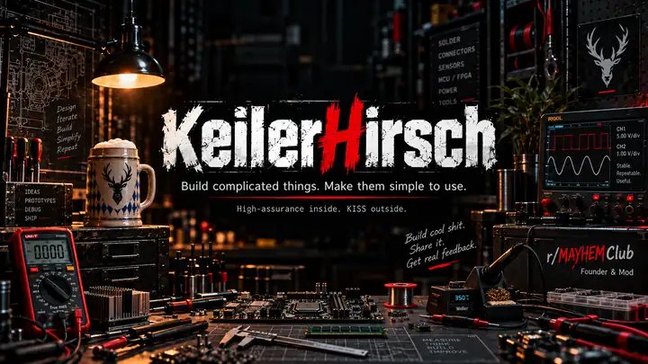
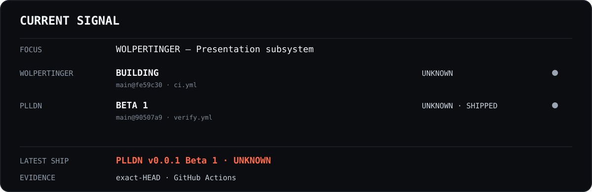

**I build complicated systems so the user doesn't have to operate one.**

[MyRank](https://myrank.dev/u/KeilerHirsch) · [MAYHEM Club](https://www.reddit.com/r/MAYHEMClub/) · [Ko-fi](https://ko-fi.com/keilerhirsch)

## Current signal

One small panel, four useful facts: what I am focused on, what is actively shipping, whether the selected CI is healthy, and the latest public release. No contribution heatmap archaeology required.

## Selected work

### [WOLPERTINGER](https://github.com/KeilerHirsch/WOLPERTINGER)

An Elite Dangerous companion platform built around **one core and multiple presentation surfaces**. The point is simple: fewer separate tools for the Commander to coordinate, with the complicated state, replay, provenance, and assurance machinery kept underneath.

### [PLLDN — Programming Language & Licensing Decision Navigator](https://github.com/KeilerHirsch/PLLDN-Programming-Language-Licensing-Decision-Navigator)

Turns real project constraints into technology choices you can actually defend. Deterministic filters stay authoritative, unknown evidence stays unknown, and free text is an accelerator rather than an AI oracle.

[Use PLLDN](https://keilerhirsch.github.io/PLLDN-Programming-Language-Licensing-Decision-Navigator/) · [Latest release](https://github.com/KeilerHirsch/PLLDN-Programming-Language-Licensing-Decision-Navigator/releases)

## How I build

- **Evidence before claims.** Tests, review, provenance, and reproducible artifacts should prove what the README says.
- **Deterministic where it matters.** If explicit rules and traceable facts can answer a core decision, fuzzy inference does not get to own it.
- **High-assurance inside. KISS outside.** Complexity belongs in the machine room, not in the user's startup ritual.

## MAYHEM Club

I am the **Founder & Mod** of [r/MAYHEMClub](https://www.reddit.com/r/MAYHEMClub/), a creator-first space for indie devs, modders, toolmakers, open-source builders, and people shipping wonderfully weird things.

**Build cool shit. Share it. Get real feedback.** Self-promotion is normal; spam is not. No karma gates, promo rituals, permission slips, or mandatory ceremony before you can show what you made.

For project-specific bugs or ideas, use the issue tracker in the relevant repository. For the workshop floor, MAYHEM Club is open.
